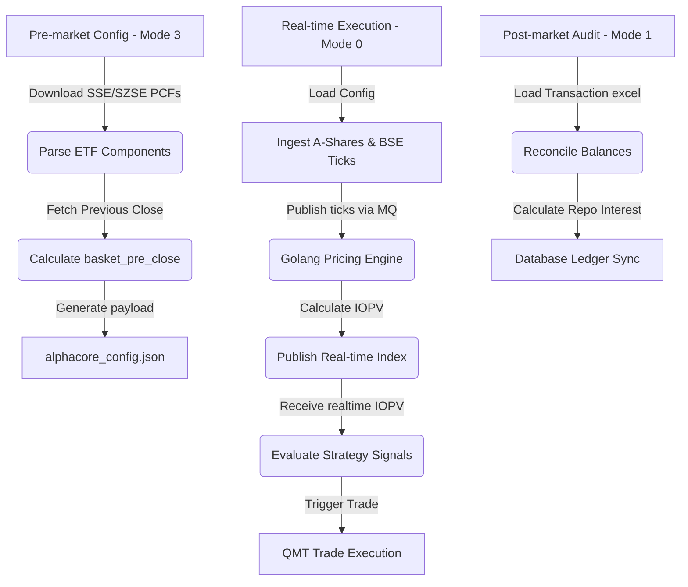

# StockQMT: Real-Time Index Replication and Arbitrage Execution Engine

StockQMT is an enterprise-grade quantitative trading framework designed for high-performance index replication, statistical arbitrage, and real-time portfolio management. Built for integration with XunTou QMT (`xtquant`), the system couples low-latency market data ingestion with a hybrid Python/Golang dual-engine architecture to enable sub-10ms pricing calculations and execution routing.

This repository serves as a technical showcase for quantitative system design, highlighting database schema design, multi-market quote ingestion, and robust error-handling pipelines suitable for professional trading desks.

---

## 1. Key Features

### 📡 Hybrid Telemetry & Ingestion (QMT + TQ)
- **A-Share Coverage**: Leverages QMT’s memory bus via `xtdata.subscribe_whole_quote` for high-throughput, callback-driven L1 orderbook updates.
- **BSE Connectivity**: Integrates the TongDaXin TQ SDK to stream Beijing Stock Exchange (BSE) quotes concurrently.
- **Resilient Fallbacks**: Employs EastMoney scraping pipelines as a secondary quote source to automatically recover missing benchmark details.

### ⚡ Golang/Python IPC Interface
- Utilizes **NanoMQ** as an ultra-low-latency MQTT broker for inter-process communication.
- Streams batch L1 market ticks (`alphacore/tick/batch`) to the Golang pricing engine, which processes component weights and publishes real-time ETF IOPV calculations back (`alphacore/index/realtime`).

### ⚙️ AlphaCore Index Replication Engine
- Parses ETF Portfolio Composition Files (PCF) across Shanghai (SSE) and Shenzhen (SZSE) exchanges.
- Handles cash components, cash substitutions, and standardizes multi-market tickers (SSE, SZSE, BSE, HKEX).
- Implements a 60-day historical lookback query to extract close prices for suspended components, preventing valuation gaps.

### 🛡️ Mathematical Risk & Penalty Model
- Computes **daily excess volatility** relative to A-share benchmarks (CSI 300, SSE Composite, SZSE Component) over a 3-day window.
- Dynamically generates adaptive pricing penalties to scale premium/discount execution thresholds, mitigating slippage under elevated volatility.

### 🐶 Autonomous Watchdog Telemetry
- A singleton watchdog daemon monitors quote stream intervals.
- Generates automated push notification payloads (routed via Bark iOS push API) to alert operators of system heartbeats or data anomalies.

---

## 2. Directory Structure

```filepath
├── config.ini               # Broker credentials, DB configurations, and data file paths
├── main.py                 # System entrypoint (CLI runner for execution modes)
├── db/                     # Database Access Object (DAO) Layer
│   ├── db_pool.py          # PyMySQL connection pooling (DBUtils)
│   ├── idx_components.py   # Component audits, incremental sync, and dual-language soft deletes
│   ├── index_daily_history.# Volatility tracking, daily ticks, and database bulk transactions
│   ├── stock.py            # A-share ticker registry and pricing updates
│   ├── strategy_flows.py   # Rebalancing sequence and remained amount ledger
│   └── strategy_record.py  # Rebalancing lifecycle and account allocations
├── helper/                 # Shared Utility Layer
│   ├── data_loader.py      # Excess volatility calculations and holding state synchronization
│   ├── date_utils.py       # High-performance date slicing and formatting utilities
│   ├── notifier.py         # Bark push notification request wrapper with retry loops
│   ├── spider.py           # EastMoney web scrapers for ETF/Index fallback quotes
│   └── time_utils.py       # Time snapshot cache for sub-10ms precision queries
├── service/                # Core Logic Modules
│   ├── account.py          # Broker platform path mappings and credentials manager
│   ├── watchdog_service.py # Heartbeat watchdog monitoring quote streams
│   ├── trader_service.py   # Order placement wrapper, locks, and thread managers
│   ├── stock_service.py    # SSE ETF sector synchronizers and index validators
│   ├── stock_queue.py      # Bid/Ask priority queues for strategy signal matching
│   ├── trans_flows.py      # Daily accounting flow parser and cash balance reconciler
│   └── pcf/                # Portfolio Composition File (PCF) Providers
│       ├── pcf_provider.py # Base class for PCF scraping and cleaning
│       ├── sse_pcf_provider.py # Shanghai Stock Exchange PCF parser (SSE commonQuery)
│       └── szse_pcf_provider.py# Shenzhen Stock Exchange PCF parser & caching
└── strategies/             # Strategic Decision-Making Layer
    ├── strategy1.py        # Discount rebalancing strategy (LOF focus)
    └── strategy2.py        # Real-time ETF arbitrage strategy (IOPV comparison)
```

---

## 3. Core Operational Pipeline



---

## 4. Installation & Requirements

### System Requirements
- OS: Windows (Required for XunTou QMT Terminal integration)
- Python 3.8+
- Active A-share broker account with QMT/miniQMT access

### Dependencies
Install the required packages using pip:
```bash
pip install pymysql DBUtils paho-mqtt requests pandas openpyxl xlrd tqdm rich psutil
```

### Configuration
Update the [config.ini](file:///d:/PythonProject/stockQMT/config.ini) file with your database credentials, broker account IDs, and the paths to your local QMT installation.

---

## 5. Usage CLI Guide

The system is executed via the `main.py` entrypoint. The `-mode` argument defines the system phase:

### 1. Pre-Market Initialization (Mode 3)
Generates the base basket configuration (`alphacore_config.json`) by retrieving the PCF lists, evaluating index target mappings, and downloading A-share close data:
```bash
python main.py -mode 3
```

### 2. Real-Time Trading (Mode 0)
Launches the execution engine with the specified strategy and broker platform.
- **Run Discount Strategy (s1)** on Xiangcai broker:
  ```bash
  python main.py -mode 0 -platform 湘财证券 -s s1
  ```
- **Run ETF Arbitrage Strategy (s2)** on Datong broker:
  ```bash
  python main.py -mode 0 -platform 大同证券 -s s2
  ```

### 3. Post-Market Portfolio Accounting (Mode 1)
Parses the transaction flows from the broker export file, calculates interest from reverse repos, and reconciles cash balances:
```bash
python main.py -mode 1 -platform 湘财证券
```

### 4. Market Data Update (Mode 2)
Updates daily stock history and calls the volatility engine to compute index penalty rates:
```bash
python main.py -mode 2
```

### 5. Sector Maintenance (Mode 5)
Synchronizes the SSE exchange-traded fund registry with QMT's local database:
```bash
python main.py -mode 5
```

---

## 6. Development & Quality Assurance

To check the syntax integrity of the codebase:
```powershell
Get-ChildItem -Filter *.py -Recurse | ForEach-Object { python -m py_compile $_.FullName }
```
All system scripts have been compiled successfully with zero syntax errors.
